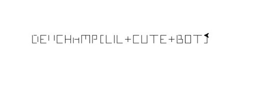

# Artist Robot
## Scripting [100 pts]
## Problème 
Nous avons mis la main sur un robot, qui selon nos informations permettait à un groupe de hacker de communiquer entre eux. Nos équipes ont réussi à extraire le programme que contenait le robot, aidez-nous à retrouver le message que le robot devait passer !  
[Fichier attaché](files/2penbot.txt)
## Résolution
Les aspects `U - Pen Up` et `D - Pen Down` font penser au dessin caractère, par caractère. Voici notre script:
```python3
from turtle import *

z = "ESDSSSSSSEEEUENDNNNNUNWDWWUEEEEEDEEEEWWWWSSSEEWWSSSEEEEUEENNNNNNDSSSSUSEDUSEDUNEDUNEDNNNNUEEDEEEEWWWWSSSSSSEEEEUEEDNNNNNNSSSEEEENNNSSSSSSUEEDNNNNUNEDUNEDUSEDUSEDSWWWEEESSSUEEDNNNNNNEEESSSNNNEEESSSSSSUEEDNNNNNNEEESSSWWUSSSEEEEEEEDWWNNNNNNEEUEEDSSSSSSEEEEUEEDNNNNNNUEEDSSSSSSEEEEUEEEENDNNNNSSWWEEEEUEENNNDEEEEWWWWSSSSSSEEEEUEENNNNNNDSSSSSSEEEENNNNNNUEEDEEEEEEWWWSSSSSSUEEEEEDNNNNNNEEEEWWWWSSSEEWWSSSEEEEUEEEENDNNNNSSWWEEEEUEENNNDSSSSSSEEEENNNWWWEENNNWWUEEEEEDSSSSSSEEEENNNNNNWWWWUEEEEEEDEEEEEEWWWSSSSSSUEEEEEDEENNNNNNWW"

delay(2)
north={"N":0, "E":1, "S":2, "W":-1}
south={"N":2, "E":-1, "S":0, "W":1}
west={"N":1, "E":2, "S":-1, "W":0}
est={"N":-1, "E":0, "S":1, "W":2}
p="E"
a=90
pu()
goto(-200,0)

for c in z[1:]:
    if c == "D":
        pd()
        continue
    if c == "U":
        pu()
        continue
    if p == "E":
        rt(a*est[c])
        fd(3)
    elif p == "S":
        rt(a*south[c])
        fd(3)
    elif p == "N":
        rt(a*north[c])
        fd(3)
    elif p == "W":
        rt(a*west[c])
        fd(3)
    p=c

done()

```

## Flag


