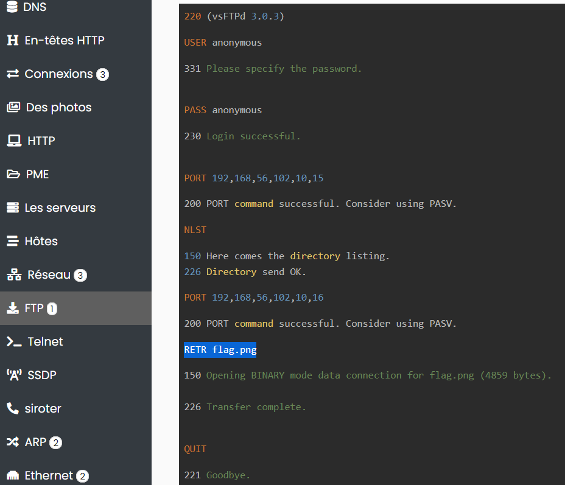
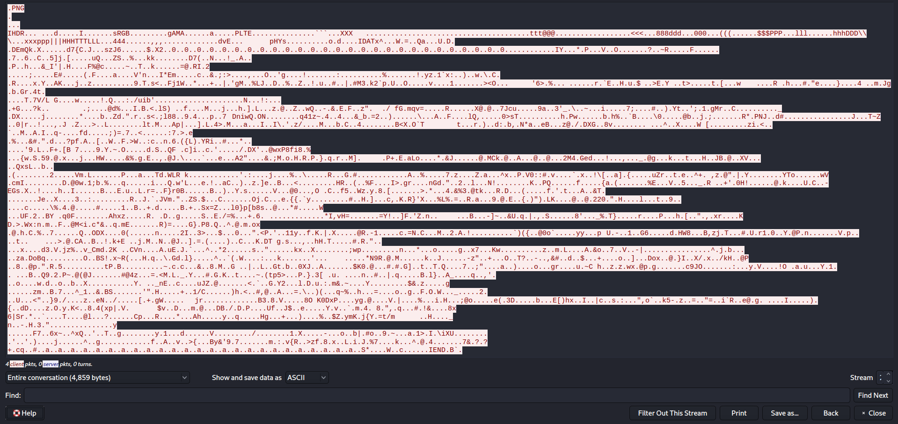
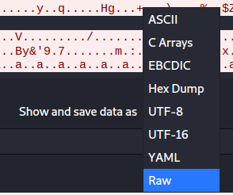

# Fragment Transfer Protocol
## Network [125 pts]
## Problème 
À cause d'une erreur de configuration, un attaquant a pu se connecter à notre serveur FTP et voler des données confidentielles. Trouvez ce que contenaient le fichier volé afin que nous prenions les mesures nécessaires.  

[Fichier attaché](files/capture.pcapng)
## Résolution
On analyse le fichier avec : https://apackets.com/upload > upload file > voir le rapport
  

Ensuite avec wireshark, on applique le filtre (ftp-data) sur le fichier.
On inspecte le paquet No 46 qui récupère la copie d'un fichier flag.png, il fallait le voir de près. Clique droit;  Suivre; FTP stream  

On voit le header du PNG,  
  
On change vers RAW, on enregistre sous le format png.  
## Flag

